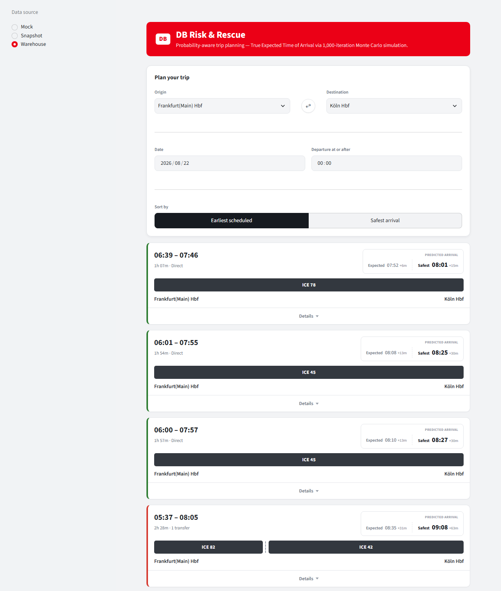

# DB Risk & Rescue

Trip planning for German railways that answers the question a timetable can't: **will I actually make my connection, and what happens if I don't?**

Standard journey planners show you a scheduled arrival. This one runs a Monte Carlo simulation over historical delay data for every leg of your trip, then reports a **True ETA** — both the typical arrival and the "plan for this if you're unlucky" arrival — alongside a per-transfer risk read and a pre-computed backup plan for each connection that might fail.

Built on offline GTFS.DE timetable data and the [piebro/deutsche-bahn-data](https://huggingface.co/datasets/piebro/deutsche-bahn-data) historical delay archive. No live API calls.



*Each card carries two predictions — **Expected** (typical) and **Safest** (the 85th percentile) — plus a coloured left edge summarising the route's overall risk. The three direct trains are green; the one-transfer route at the bottom is red because its Safest arrival lands 63 minutes past schedule.*

---

## Quickstart

Requires **Python 3.11+**.

```bash
pip install -r requirements.txt
```

```bash
streamlit run app.py
```

The app opens on a search form: pick an origin, destination and departure time, and it returns ranked route cards showing predicted arrivals and transfer risk. Open **Details** on any card for the leg-by-leg itinerary.

### What data you get on a fresh clone

The sidebar has a **Data source** selector with three backends. Two work immediately; one needs a build step:

| Backend | Works after clone? | What it is |
|---|---|---|
| **Mock** | Yes | A small hand-authored fixture (11 stations). Fast, good for poking at the UI. |
| **Snapshot** | Yes | Real GTFS + delay data for a 33-station corridor, baked to one fixed date. |
| **Warehouse** | **No — needs building** | The same corridor, queryable for *any* date in a month-long window. The default selection. |

> **Heads-up on your first run.** Warehouse is selected by default, but its database file is a build artifact and isn't in the repo. When it's missing the app says so in the sidebar and drops to **Snapshot** — still real data, just pinned to one date. Build the warehouse when you want to search other dates.

To build the Warehouse backend yourself (downloads a few hundred MB of raw feeds):

```bash
python -m pipelines.download_raw_data
```

```bash
python -m pipelines.build_warehouse
```

### Running the tests

```bash
python -m pytest
```

---

## How it fits together

```
GTFS.DE timetable ─┐
                   ├─► pipelines/ ─► Pydantic contract ─► routing/ ─► engine.py ─► ui_components.py
piebro delay data ─┘   (ingest,      (Station, Leg,       (routes)    (Monte Carlo (route cards,
                       crosswalk,    Transfer, Route)                 simulation)  risk colours)
                       aggregate)
```

The **Pydantic contract** in `models.py` is the load-bearing idea. Everything upstream of it exists to produce those five object types; everything downstream consumes them and neither knows nor cares which backend produced them. That boundary is why the storage layer could be swapped from JSON files to a DuckDB warehouse without the simulation engine changing at all.

---

## Where to read next

Three specs, each owning one thing. Pick by what you're changing:

| I want to… | Read | Start at |
|---|---|---|
| Understand the risk maths | `SPEC.md` | §3 — there's a worked example at the top |
| Look up a threshold or constant | `SPEC.md` | §6 — every hardcoded number, in one table |
| Change colours, wording, or layout | `UIUX_SPEC.md` | §2 — the five-state risk system |
| Work on data ingestion or the warehouse | `DATA_SPEC.md` | §3 (ingestion) or §6 (warehouse schema) |
| Know why the project looks like this | `SPEC.md` | §7 — development phases |
| Find the known rough edges | `DATA_SPEC.md` §10, `SPEC.md` §8 | |

`CLAUDE.md` is configuration for AI coding agents, not human documentation — you can skip it.

**Two naming conventions worth knowing up front.**

*Mock / Snapshot / Warehouse* are the three backends you can select at runtime. *Phase 1 / 2 / 3* are the project's development stages, which happen to have produced those backends in that order. The specs use both, deliberately — `SPEC.md` §4.2 maps between them.

And one wart: the Pydantic class holding a loaded dataset is called **`MockDataset`**, but it is not the Mock backend — all three backends produce one. The name dates from Phase 1, when the Mock fixture was the only source.

---

## Project layout

The root holds the application modules, the docs, and two config files —
nothing else. Datasets live in `data/`, tests in `tests/`, the design reference
in `design/`, and README imagery in `assets/`.

```
app.py              Streamlit entry point — search flow, caching, pagination
engine.py           Monte Carlo simulation, risk scoring, fallback re-routing
models.py           The Pydantic contract everything is built around
ui_components.py    Route cards, risk colours, the expanded itinerary
data_loader.py      Loads the JSON backends (Mock, Snapshot)
db.py               DuckDB connection helper for the Warehouse backend
gtfs_time.py        GTFS time/calendar helpers shared by pipelines/ and routing/
pytest.ini          Puts the repo root on sys.path so tests/ can import the above
requirements.txt    Pinned dependencies

pipelines/          Offline ingestion, delay aggregation, warehouse build (python -m)
routing/            Candidate route search and filtering, on every request
tests/              The pytest suite

data/
  mock_data.json     Mock backend — hand-authored, committed
  real_dataset.json  Snapshot backend — pipeline output, committed
  warehouse.duckdb   Warehouse backend — pipeline output, gitignored
  fixtures/          Small GTFS feeds for the demo pipeline and the test suite
  raw/               Downloaded GTFS.DE / piebro archives, gitignored

design/
  design_mock.html   The reference mockup UIUX_SPEC.md's visual system came from

assets/
  screenshot.png     The screenshot at the top of this README

.streamlit/
  config.toml        Native Streamlit widget theme (UIUX_SPEC.md §3 owns the values)
```

The three files at the top of `data/` are the three backends the sidebar radio
switches between (`SPEC.md` §4.2). Only the first two are in git — see
"Missing-data degradation" in `SPEC.md` §4.2 for what happens on a fresh clone.

The three specs (`SPEC.md`, `DATA_SPEC.md`, `UIUX_SPEC.md`) stay at the root
next to this README, where they're easiest to find, as does `CLAUDE.md` —
which is agent configuration rather than a spec.
